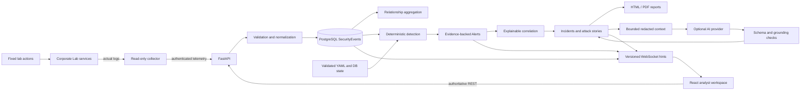
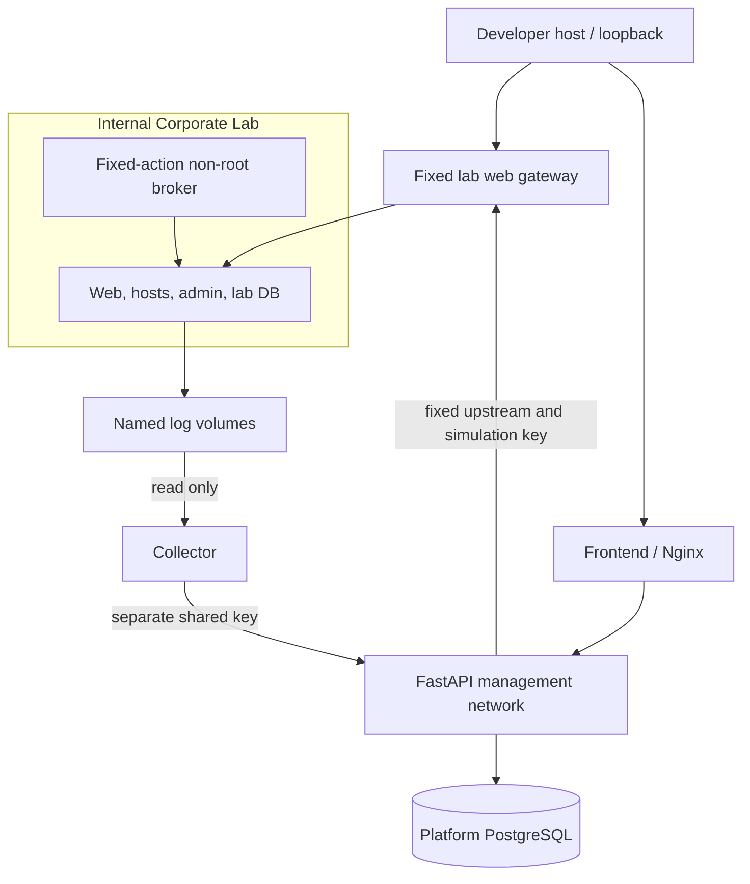

# SENTINEL

**Evidence-first security monitoring, attack detection, incident investigation, and controlled Purple Team validation in one reproducible local platform.**

[](https://github.com/Mayroskapnos/sentinel-security-platform/actions/workflows/ci.yml)

[](LICENSE)

SENTINEL is a portfolio-grade experimental security observability platform. A fictional, isolated Docker corporate lab produces genuine service and operating-system logs; SENTINEL collects, normalizes, detects, correlates, visualizes, investigates, and exports the resulting evidence. It emphasizes transparent state, conservative security claims, and safe demo boundaries.

> This is not a production SIEM, penetration-testing tool, or forensic/compliance system. The local application has no user authentication, RBAC, or TLS termination. Do not expose it to the public internet or target systems outside the bundled lab.

## Demo / Preview

The primary portfolio path is `SCN-005`: a fixed multi-stage lab sequence that produces real source logs and demonstrates the complete path through telemetry, Alerts, Incident correlation, Attack Map, optional grounded AI, and PDF/HTML reporting.

Real product screenshots were not committed because automated browser capture was unavailable during release-candidate validation. The exact manual capture list is in [docs/images/README.md](docs/images/README.md); no screenshots are fabricated.

## Why I Built It

Security products are often shown as disconnected dashboards or opaque alerts. SENTINEL explores the engineering underneath: identity resolution, durable evidence, time windows, suppression, state transitions, async delivery, correlation ambiguity, topology semantics, provider trust boundaries, and analyst-ready outputs. The goal is a coherent full-stack system that can explain what it observed and what it did not prove.

## What SENTINEL Does

```text
fixed lab action -> actual service log -> read-only collector
                 -> validated SecurityEvent -> PostgreSQL
                 -> deterministic detection -> evidence-backed Alert
                 -> explainable Incident correlation -> Attack Map
                 -> optional grounded analysis -> Incident report
```

- Stores canonical Assets and immutable normalized SecurityEvents.
- Evaluates five repository-defined threshold, sequence, and contextual rules.
- Links every Alert to relational event evidence and applies deterministic suppression.
- Runs five safe, fixed-target validation scenarios in the bundled lab.
- Builds observed asset relationships and exact ScenarioRun/Incident topology.
- Correlates Alerts into persistent Incidents using stored evidence signals and scores.
- Provides optional bounded, redacted, validated AI summaries and Incident Q&A.
- Exports point-in-time self-contained HTML and printable PDF Incident reports.
- Delivers low-latency WebSocket hints while REST/PostgreSQL remain authoritative.

## End-to-End Architecture



PostgreSQL is the durable source of truth. WebSockets never replace REST recovery, ScenarioRun intent never replaces observed evidence, and the AI provider cannot modify security state. See [Architecture](docs/architecture.md), [Telemetry](docs/telemetry.md), and [Security Model](docs/security-model.md).

## Flagship Demo

1. Start the full stack and confirm System health.
2. Open Attack Simulator and run `SCN-005`.
3. Watch persisted steps while expected-but-unobserved detections remain neutral during the active run.
4. Follow observed Alerts and the correlated Incident after terminal status.
5. Inspect deterministic story stages, correlation signals, evidence links, authoritative ATT&CK, and affected assets.
6. Open the Incident-scoped Attack Map; only persisted evidence relationships appear.
7. Export an evidence-only PDF or HTML Incident report.
8. Optionally enable the local mock assistant, generate analysis, and explicitly include its separately labeled section in a second report.
9. Restart and show that runs, evidence, incidents, analyses, and report regeneration persist.

Use the narrated [Demo Guide](docs/demo.md). Detection suppression is respected and never bypassed, so wait for its five-minute cooldown before repeating a scenario that expects the same rule.

## Core Capabilities

### Monitoring and live delivery

- Canonical five-asset inventory synchronized from repository definitions.
- Validated telemetry ingestion, deterministic asset resolution, monotonic freshness, bounded bodies, server filters, and pagination.
- Versioned WebSocket messages after database commit, browser origin allow-listing, reconnect recovery, and ID deduplication.
- Dashboard summary, selectable 1h/6h/24h/72h/7d activity, recent Incidents, and risk posture.

### Detection and alerting

- Strict Pydantic/YAML rule definitions synchronized while preserving analyst enable state.
- Database-backed threshold/sequence windows and contextual single-event rules.
- Suppression, evidence attachment, analyst lifecycle, risk recomputation, and live update handling.
- ATT&CK mapping only when telemetry supports the asserted technique. `DET-DB-001` intentionally has no technique because a connection does not prove database queries, collection, or exfiltration.

### Corporate Lab and simulator

- Separate DMZ, employee, server, and management networks.
- Web/HTTP, Linux audit, SSH, sudo, PostgreSQL, network, and health log sources.
- Read-only collector volumes with durable checkpoints and bounded retry.
- Five declarative scenarios, one-run database constraint, cancellation, restart recovery, and exact run attribution.
- No arbitrary hostnames, addresses, URLs, ports, commands, SQL, payloads, credentials, scanning, exploitation, or external targets.

### Attack Map and Incidents

- Persisted aggregate source/destination/protocol/port/type relationships between known assets.
- Backend-driven React Flow topology with zone/filter/window views, observed activities, alert/asset details, exact run/Incident overlays, and honest empty/offline states.
- Persistent Incidents with bounded multi-signal correlation, single Alert membership, explainable confidence, affected Assets, workflow state, and deterministic chronological stories.

### Investigation and reporting

- Disabled-by-default mock/OpenAI provider abstraction, bounded redaction, prompt separation, structured validation, evidence citations, uncertainty, staleness, persistent analysis history, and Incident-scoped Q&A.
- Authoritative report-context service shared by self-contained HTML and printable A4 PDF renderers.
- Safe attachment filenames/headers, HTML escaping/CSP, snapshot semantics, privacy warning, limitations, and AI opt-in.

## Security Architecture



Published ports bind only to `127.0.0.1`. Platform and lab databases, credentials, and volumes are separate. Containers are unprivileged where practical, logs are bounded, no service mounts the Docker socket or host root, and the simulator broker has no host port or generic execution route. These are strong local-development controls, not production authorization. Full boundaries and residual risk are in [Security Model](docs/security-model.md).

## Deterministic vs AI

Detections, Alert evidence, correlation, Incident state, ATT&CK mappings, counts, story, topology, and report facts are deterministic and database-backed. The optional assistant is a non-authoritative analysis aid. It receives only a server-built bounded/redacted Incident snapshot, has no tools or database access, and cannot run scenarios, modify state, contain assets, or alter report facts.

The local mock sends no data externally. Configured OpenAI use sends selected redacted evidence to an external provider and therefore adds a privacy/retention boundary. Provider failure never degrades core health, detection, incidents, or reports. See [Investigation Assistant](docs/investigation-assistant.md).

## Technology Stack

| Layer    | Technology                                                                                          |
| -------- | --------------------------------------------------------------------------------------------------- |
| Frontend | React 19, strict TypeScript, Vite, Tailwind CSS, TanStack Query, React Router, Recharts, React Flow |
| Backend  | Python 3.12+, FastAPI, Pydantic, SQLAlchemy 2 async, Alembic, Uvicorn, ReportLab                    |
| Data     | PostgreSQL 16, relational evidence, JSONB context/snapshots                                         |
| Runtime  | Docker Compose, Nginx, isolated internal bridges, health checks                                     |
| Quality  | pytest, Ruff, Vitest, ESLint, Prettier, GitHub Actions, Compose/lab validators                      |

## Quick Start

Requirements: Docker with Compose v2, Git, approximately 4 GB free memory, and loopback ports `3000`, `8000`, `5432`, and `8081` (or customize them).

For a complete clone-to-demo walkthrough, see [How to Run SENTINEL](HowToRunMe.md).

```bash
git clone https://github.com/Mayroskapnos/sentinel-security-platform.git
cd sentinel-security-platform
cp .env.example .env
docker compose up --build -d
docker compose ps
```

PowerShell uses `Copy-Item .env.example .env`. Open <http://127.0.0.1:3000> and verify <http://127.0.0.1:8000/api/v1/health>. Startup applies migrations and synchronizes rules/assets; historical demo events remain optional.

```bash
docker compose exec -T backend python -m app.cli.seed
```

See [Getting Started](docs/getting-started.md) and [Configuration](docs/configuration.md) for host development, port changes, optional AI, and troubleshooting.

## Demo Workflow

```bash
make demo-ready
make scenario-run SCENARIO=SCN-005
```

For a clean development demonstration:

```bash
make demo-reset
make demo-ready
```

`demo-reset` removes generated telemetry/investigation history only after an explicit development-only guard. It preserves assets, rules, and migrations. It is not a production retention tool. The complete zero-to-report workflow and mock AI setup are in [Portfolio Demo](docs/demo.md) and [Incident Reporting](docs/reporting.md).

## Testing

CI runs backend lint/format in the exact multi-directory context, configuration validators, pytest, Alembic upgrade/check, frontend lint, strict TypeScript, Vitest, Prettier, production build, npm high-severity audit, Compose rendering, and lab-isolation validation.

```bash
make release-check
```

Or run the exact checks documented in [v1.0 Release Checklist](docs/release-checklist.md). Backend tests use isolated SQLite where appropriate; CI migration checks use PostgreSQL. Real-container scenario validation remains a separate acceptance layer.

## Project Structure

```text
SENTINEL/
├── backend/                 FastAPI, domain models, services, rules, reports, tests
│   ├── alembic/             Versioned PostgreSQL migrations
│   └── app/                 API, repositories, detection, correlation, AI, CLI
├── frontend/                React/TypeScript analyst workspace and tests
├── lab/                     Isolated corporate services, collector, host agent
├── tools/                   Safe producers and integration/config validators
├── docs/                    Architecture, security, API, demo, reporting, release
├── docker-compose.yml       Full 11-service local topology
├── Makefile                 Repeatable developer/demo/release commands
└── .github/workflows/ci.yml CI-equivalent validation
```

## API

OpenAPI is served at <http://127.0.0.1:8000/api/docs>. The versioned surface includes health, Assets, SecurityEvents, telemetry ingestion, Alerts, rules, dashboard, lab/simulator state, ScenarioRuns, topology/relationships, Incidents, optional assistant operations, and Incident report download.

Representative report routes:

```text
GET /api/v1/incidents/{incident_id}/report?format=pdf&include_ai=false
GET /api/v1/incidents/{incident_id}/report?format=html&include_ai=false
```

See the maintained [API Reference](docs/api.md).

## Limitations

- No user authentication, RBAC, tenant isolation, TLS termination, key rotation, or production ingress.
- Single-backend-process WebSocket delivery, suppression serialization, and correlation coordination.
- No durable queue, long-term retention policy, packet capture, endpoint agent, threat-intelligence feed, or cross-instance pub/sub.
- Corporate Lab uses fictional services and controlled activities; it is not a vulnerable target range.
- Incident confidence is an experimental deterministic score, not compromise probability.
- Missing telemetry never proves absence; network relationships are aggregates, not packet-level sessions.
- Reports are unsigned point-in-time artifacts without chain-of-custody or forensic certification.
- Redaction and AI grounding reduce risk but cannot prove every natural-language claim or detect every sensitive value.
- Docker internal networking does not protect against a user with Docker daemon access.

## Future Work

Production identity/authorization, TLS ingress, service identities, durable delivery, distributed coordination, retention and deletion policy, signed report provenance, queued large exports, richer rule authoring, broader telemetry adapters, threat-intelligence enrichment, accessibility audits with assistive technology, and deployment hardening are deliberately left beyond v1.0.

## License

MIT - see [LICENSE](LICENSE).

Release details: [v1.0.0 Notes](docs/release-notes-v1.0.0.md) · [Changelog](CHANGELOG.md) · [Portfolio Notes](docs/portfolio.md)
