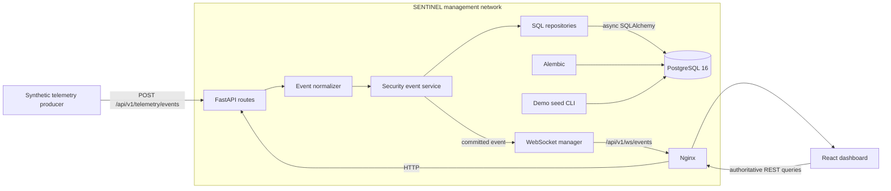
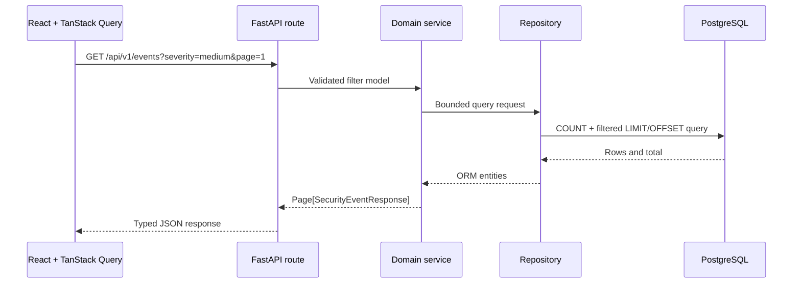
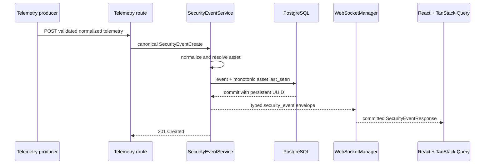
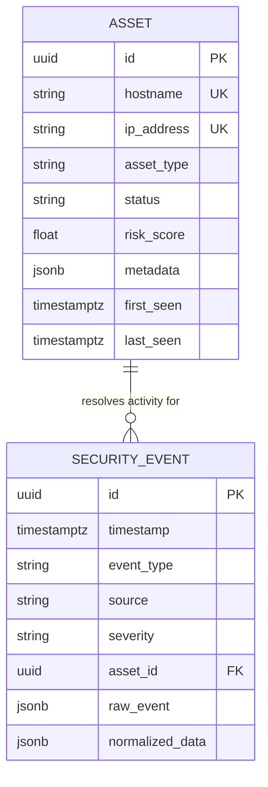

# SENTINEL Architecture

This document describes the implemented Milestone 2 architecture. Detection, correlation, attack simulation, and lab services are not operational components.

## Runtime topology

## REST query flow

Routes handle transport concerns, services enforce application behavior, and repositories own SQL construction.

## Live telemetry flow

Broadcast happens only after a successful commit. A socket failure is isolated after persistence and never rolls back the event. With no connected clients, ingestion continues normally.

## Data model

Security events may remain unresolved. Deleting an asset sets its event foreign keys to null rather than deleting historical evidence.

## Normalization and asset resolution

Real collectors are deliberately absent. `EventNormalizer` validates the canonical schema, normalizes categorical strings and hostnames, and converts timestamps to UTC. The synthetic producer exercises this contract without pretending to be a collector. Future source adapters should transform their source-specific input into `SecurityEventCreate` instead of manipulating ORM entities.

Asset resolution is deterministic:

1. Explicit valid asset ID
2. Exact normalized hostname
3. A single match across relevant destination and source IP addresses

Conflicting IP matches remain unresolved. Unknown telemetry never auto-creates assets. When an asset resolves, `last_seen` advances in the same transaction only when the incoming event is newer. Risk scores are unchanged.

## Query and cache behavior

- Assets and events use bounded page sizes with a maximum of 100 rows.
- Filtering, ordering, counts, and pagination occur in SQL.
- Events are ordered by timestamp descending with ID as a stable tiebreaker.
- Dashboard summary and activity data use dedicated database aggregation queries.
- TanStack Query remains the authoritative browser cache for REST data.
- The application maintains one typed WebSocket connection.
- Compatible newest-page event lists update directly and deduplicate by persistent ID.
- Historical pages and time ranges show a new-event notice instead of changing pagination.
- Dashboard and asset detail invalidations are debounced.
- A successful socket reconnection invalidates REST queries to recover missed events from PostgreSQL.

## Persistence lifecycle

The backend runs `alembic upgrade head` before Uvicorn starts. Alembic is the schema mechanism; application startup never invokes `Base.metadata.create_all()`. The demo seed uses deterministic UUIDs.

The telemetry transaction contains both the event insert and any monotonic asset `last_seen` update. The committed ORM object is serialized before WebSocket delivery, so clients receive the real UUID and can immediately retrieve the event through REST.

## Proxy and isolation

PostgreSQL, FastAPI, and Nginx share only the management network and publish ports exclusively on loopback. Nginx upgrades only the WebSocket route and preserves the existing HTTP proxy. FastAPI checks browser origins against an explicit development allow-list.

The connection manager is intentionally process-local because Compose runs one backend instance. Multi-instance deployments require shared pub/sub for cross-instance delivery. Milestone 2 does not add Redis, Kafka, RabbitMQ, or any other broker.
