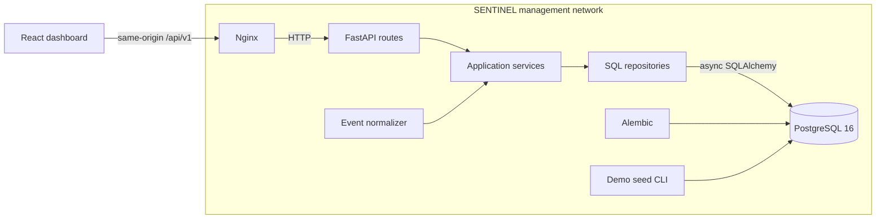
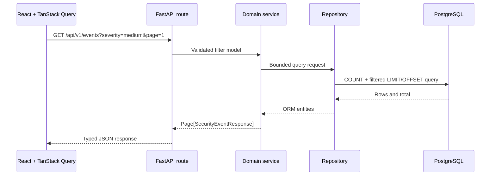
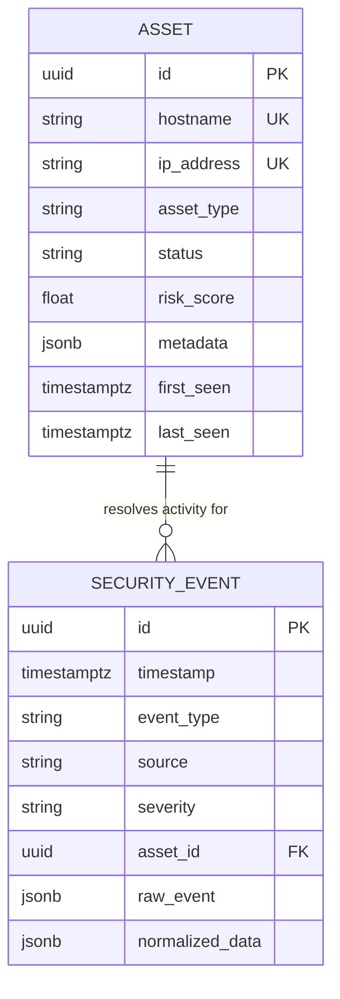

# SENTINEL Architecture

This document describes the implemented Milestone 1 architecture. Detection, correlation, WebSockets, simulator, and lab services are not operational components yet.

## Runtime topology

## Backend request flow

Routes handle HTTP concerns, services enforce application behavior, and repositories own SQL construction. This is intentionally a small layering model rather than a generic enterprise framework.

## Data model

Security events may remain unresolved (`asset_id` is nullable). Deleting an asset sets its event foreign keys to null rather than deleting historical evidence.

## Event normalization

Collectors are deliberately absent in Milestone 1. The `EventNormalizer` accepts source-adapter output, validates it against the canonical schema, normalizes categorical strings and hostnames, and converts timestamps to UTC. Future adapters can transform source-specific telemetry before calling the same service without changing storage or API contracts.

## Query behavior

- Assets and events use bounded page sizes with a maximum of 100 records.
- Filtering, ordering, counts, and pagination occur in SQL.
- Events are ordered by timestamp descending with ID as a stable tiebreaker.
- Asset-event relationships are loaded with `selectinload`, avoiding N+1 queries.
- Dashboard summary and activity data use dedicated count/group queries.
- Investigative fields and asset filter fields have targeted indexes; unfiltered JSON evidence is not indexed.

## Persistence lifecycle

The backend runs `alembic upgrade head` before Uvicorn starts. Alembic is the normal schema mechanism; application startup never invokes `Base.metadata.create_all()`. The demo seed uses deterministic UUIDs, so repeated execution does not multiply the core dataset.

## Frontend state

TanStack Query owns remote state and cache behavior. URL query parameters own Assets and Events filters, page selection, and the selected event drawer. No global client state library is required.

## Isolation

PostgreSQL, FastAPI, and Nginx share only the management network and publish ports exclusively on loopback. The future corporate lab will use separate Docker networks and is not implemented in this milestone.

