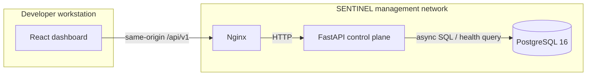
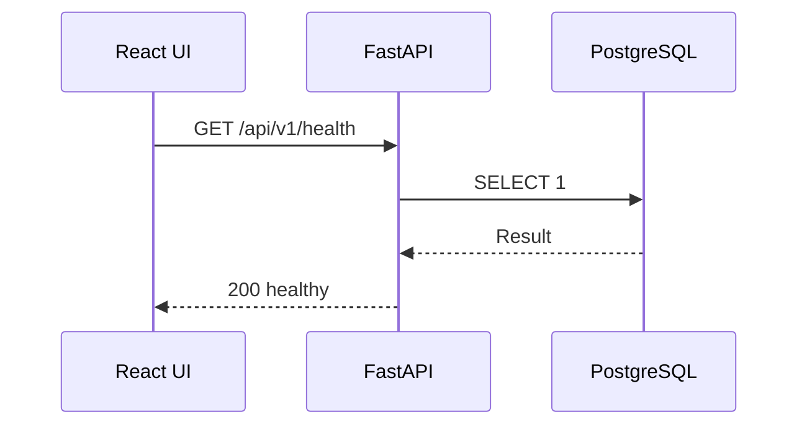

# SENTINEL Architecture

This document describes the implemented Milestone 0 architecture. It will evolve with the platform; planned detection, correlation, simulator, and lab components are deliberately not represented as operational services yet.

## Runtime topology

## Service responsibilities

- **Frontend:** React, TypeScript, Vite, Tailwind CSS, TanStack Query, and React Router. It polls the real health resource and renders explicit loading, healthy, and degraded states.
- **Reverse proxy:** Nginx serves static assets and forwards `/api/*` traffic to the backend, keeping browser configuration environment-neutral.
- **Backend:** FastAPI provides versioned APIs, Pydantic response contracts, structured logs, CORS for host development, and async SQLAlchemy connectivity.
- **Database:** PostgreSQL runs only through Docker. Its host port is bound exclusively to `127.0.0.1` for local development.

## Health flow

If PostgreSQL cannot answer, the endpoint returns `503` with a `degraded` status. This makes database health observable to Docker and the user interface.

## Repository boundaries

Backend application code is separated into API, core, database, and schema packages. Milestone 1 will add models, migrations, services, and domain APIs without replacing this foundation.

