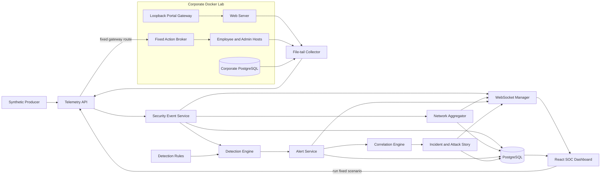
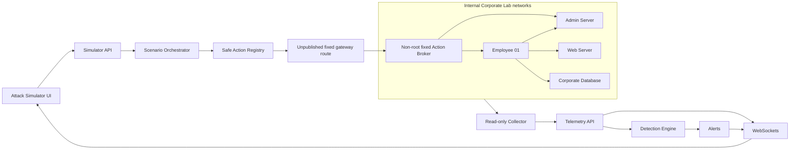
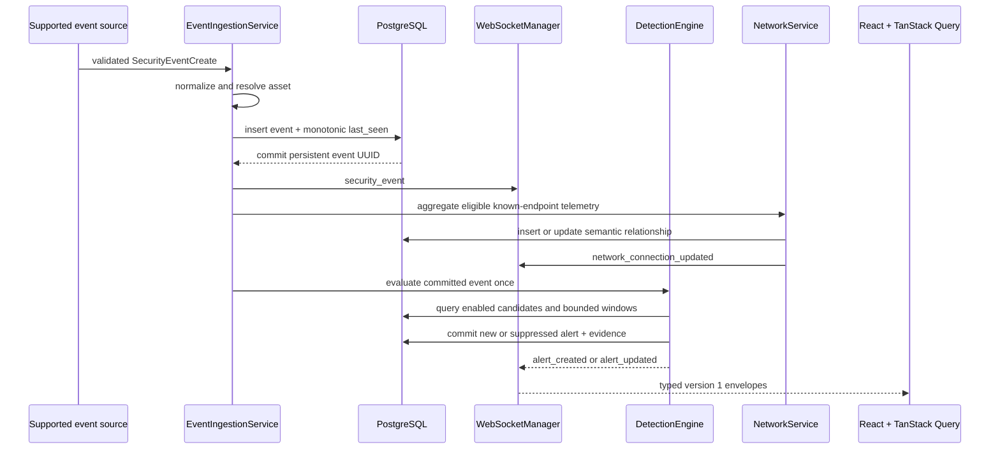
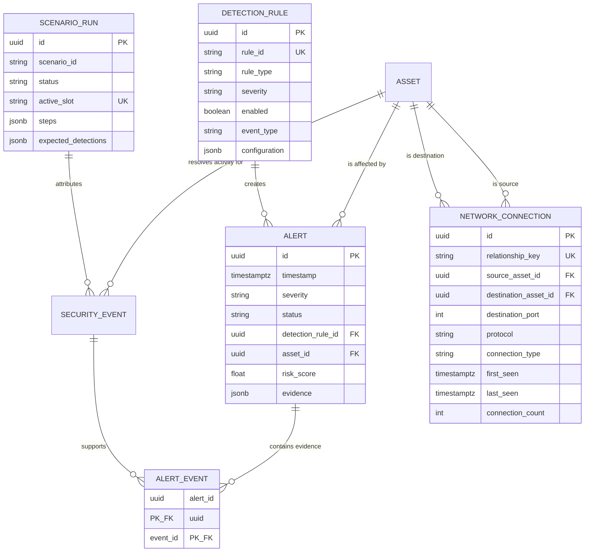
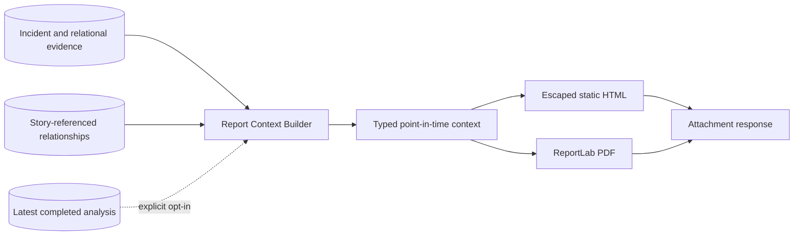

# SENTINEL Architecture

This document describes the implemented Milestone 8 architecture. Optional AI investigation assistance is an evidence-grounded layer; active response and general offensive workflows are not operational components.

## Runtime topology

The frontend Nginx proxies SENTINEL HTTP and WebSocket traffic. SENTINEL PostgreSQL, FastAPI, the frontend, the collector, and a hardened fixed-upstream portal gateway share the Compose management network. That gateway alone also joins DMZ to make the safe portal reachable at a loopback-only host port; the web app itself has no management membership or host binding. Lab services otherwise occupy separate internal DMZ, employee, and server networks. The collector reads named log volumes rather than joining those networks, and it has no Docker socket access. The corporate PostgreSQL is a separate service, volume, database, and credential boundary from SENTINEL PostgreSQL.

## Simulator architecture

The backend remains on `sentinel_management`; the broker never joins it. The gateway exposes only the fixed `/internal/simulator/` upstream on an unpublished internal listener. Broker and host APIs require the dedicated simulation key and have no generic execution route.

## Ingestion and detection lifecycle

Both `POST /events` and `POST /telemetry/events` enter this boundary and require the optional configured collector key. GET requests, REST recovery, and WebSocket reconnects never evaluate an event. Detection runs after event commit, so a broken rule cannot invalidate accepted telemetry. Per-rule failures are logged with rule and event IDs while remaining candidates continue.

## Data model

Evidence is a relational association, not an array of UUID strings. Alert detail returns compact evidence rows; original event bodies remain unchanged and are available through the event API. Asset deletion leaves historical events and alerts intact by setting optional asset foreign keys to null. Rules with alert history cannot be deleted.

## Rule state and execution

Bundled YAML under `backend/app/detection_rules` is parsed with `yaml.safe_load`, validated by Pydantic, and synchronized after migrations. Definition content is repository-controlled; the database stores current content and analyst enable state. Synchronization preserves an existing enable/disable choice. Evaluation reads enabled candidates directly from PostgreSQL, so toggles need no cache invalidation.

Threshold and sequence window counts run in SQL using event timestamps and exact match/group fields. Evidence retrieval is bounded after the count qualifies. The current event closes the window: `[event timestamp - timeframe, event timestamp]`. A late event can therefore correlate with earlier event-time records, but Milestone 3 does not replay later-timestamp records that were already ingested.

The single-process engine serializes alert creation to avoid local threshold races. Suppression uses rule ID plus configured group values. Matching activity inside the cooldown updates one active alert and attaches new evidence; a fresh qualifying window after cooldown may create another alert. A horizontally scaled backend would require database or distributed coordination.

## Query and browser cache behavior

- Assets, events, alerts, and rules use bounded server-side filtering and pagination.
- Alerts and events order by event time descending with ID tiebreakers.
- The browser maintains one versioned WebSocket connection.
- Compatible page-one lists merge live events and alerts by persistent ID.
- Historical pages and time ranges are not silently reordered.
- Alert updates remove rows that no longer satisfy cached filters.
- Dashboard and asset-detail invalidations are debounced.
- Reconnection invalidates authoritative REST data to repair missed messages.
- Compact relationship messages debounce-invalidate the bulk topology query; they do not synthesize frontend edges.
- React Flow positions are deterministic by zone and hostname while topology identity and state remain backend-owned.
- Raw JSON and rule configuration render as escaped React text, never injected HTML.

## Persistence lifecycle

The backend container runs `alembic upgrade head`, synchronizes rules, synchronizes the five canonical lab assets, and then starts Uvicorn. Alembic is the schema mechanism; application startup never calls `create_all`. Historical synthetic seeding remains explicit. Lab service telemetry and demonstration alerts pass through the same API, normalization, persistence, WebSocket, and detection path.

Scenario execution is backend-owned and persistent. WebSocket progress is advisory; browser refresh or reconnect refetches the ScenarioRun. An `active_slot` unique constraint and prerequisite query enforce one run. Startup fails stale active runs rather than resuming actions. Run summaries join attributed SecurityEvents through AlertEvent evidence to real Alerts.

Network aggregation occurs after the immutable event commit and before detection evaluation. Eligible authentication, HTTP, network-connection, database-connection, and database-session telemetry must resolve both IP endpoints to stored assets; unknown or same-asset endpoints are ignored. One relationship key combines source asset, destination asset, protocol, destination port, and connection type. Counts and first/last timestamps update in place. The scenario topology does not trust global aggregate metadata for attribution: it queries only SecurityEvents carrying the selected persistent `scenario_run_id`, then joins alert evidence. `make network-rebuild` is an explicit, bounded, deterministic migration/backfill path for earlier events.

Collector source readers persist byte offsets and file fingerprints in `lab_collector_state`. They advance after successful delivery or a rejected malformed record, retry API failures with bounded exponential backoff, and isolate source-reader failures from other sources. See [Corporate Lab](corporate-lab.md) for topology and operational details.

After each authoritative Alert commit and Alert WebSocket message, the Correlation Engine evaluates a bounded set of active Incidents. `IncidentAlert` stores single membership plus the score and signals used for the decision; `IncidentAsset` stores evidence-derived affected Assets. Derived severity, risk, confidence, summary, and story state are recalculated whenever membership or effective Alert status changes. The Incident commit precedes its WebSocket message. See [Incident Correlation](incident-correlation.md).

The incident topology performs an exact AlertEvent join and never constructs relationships from story text. ScenarioRun remains an execution record; Incident remains a security-evidence inference.

The WebSocket manager is process-local because Compose runs one backend instance. Multi-instance delivery requires shared pub/sub, and concurrent multi-instance suppression and correlation require stronger database coordination. These are documented limits rather than hidden production claims.

## Investigation Assistant architecture

```mermaid
flowchart LR
    Events[SecurityEvents] --> Alerts[Alerts]
    Alerts --> Correlation[Correlation Engine]
    Correlation --> Incident[Incident]
    Incident --> Story[Deterministic Story]
    Incident --> Context[Bounded Context Builder]
    Story --> Context
    Context --> Provider[Optional AI Provider]
    Provider --> Validation[Schema and Grounding Validation]
    Validation --> Analysis[Persisted Investigation Analysis]
    Analysis --> UI[Incident Detail UI]
```

The provider has no direct database access. The context builder creates the only evidence package, redacts and bounds raw excerpts, and stores a stable context hash. The provider cannot change Incident state. Validated results and bounded Q&A persist in PostgreSQL; WebSocket messages prompt REST recovery. See [Investigation Assistant](investigation-assistant.md).

## Incident reporting architecture

The builder calls the authoritative Incident service and queries only network relationships whose IDs appear in persisted story evidence. Both renderers consume the same typed snapshot and generate bytes in memory; the server does not retain exports. AI is optional and cannot replace deterministic fields. Report generation is synchronous because current Incident sizes are bounded; a larger deployment would move exports to a durable job queue.
