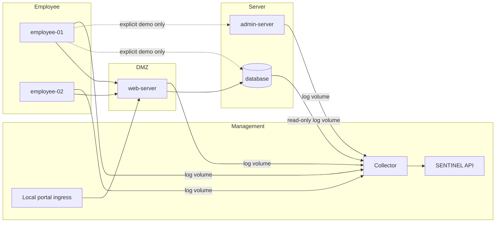

# Corporate Lab

## Purpose

The SENTINEL Corporate Lab is an isolated local environment built specifically for SENTINEL development and demonstration. It generates telemetry from actual HTTP requests, Linux processes, SSH authentication, sudo execution, TCP connections, and a separate PostgreSQL service. It contains no attack automation, deliberately vulnerable service, real personal data, or offensive tooling.

## Network topology

Three internal Docker bridge networks model corporate zones. The existing management network remains the platform and collector path.



`sentinel_dmz`, `sentinel_employee`, and `sentinel_server` are declared `internal: true`. The collector is attached only to `sentinel_management`; it reads explicit named log volumes and has no Docker socket. Because Docker Desktop does not make a port published directly from an internal-only network reachable, a fixed-upstream, unprivileged `sentinel-lab-gateway` bridges management to DMZ and is the only lab component published to the host, at `127.0.0.1:8081` by default. The web service itself publishes no port and never joins management.

## Containers and addresses

| Container | Asset hostname | Zone / canonical address | Additional permitted interface |
| --- | --- | --- | --- |
| `sentinel-web` | `web-server` | DMZ / `10.10.10.10` | Employee `10.10.20.20`, server `10.10.30.30` |
| `sentinel-employee-01` | `employee-01` | Employee / `10.10.20.10` | None |
| `sentinel-employee-02` | `employee-02` | Employee / `10.10.20.11` | None |
| `sentinel-admin` | `admin-server` | Server / `10.10.30.10` | Employee `10.10.20.30` for controlled SSH |
| `sentinel-db` | `database` | Server / `10.10.30.20` | Employee `10.10.20.21` for the explicit DB demo |
| `sentinel-collector` | Not an inventory asset | Management only | Read-only log mounts |
| `sentinel-lab-gateway` | Not an inventory asset | Management and DMZ | Fixed HTTP proxy to `sentinel-web` only |

Multi-homed service interfaces model explicit permitted flows without connecting workstations or the collector to every zone. Normalized events use canonical inventory addresses; actual service-observed addresses remain in raw evidence where an alias is required.

## Telemetry sources

| Source | Origin | Normalized activity |
| --- | --- | --- |
| `web_access` | FastAPI request middleware | HTTP method, route, response status, client endpoint |
| `web_application` | Real `/login` handling | Successful or failed demo-user authentication |
| `linux_process` | Controlled wrapper around an executed command | Executable, user, return status, category |
| `linux_auth` | OpenSSH server stderr | Successful and failed SSH authentication |
| `linux_privilege` | Actual allow-listed sudo execution | User, target user, command, return status |
| `postgresql` | PostgreSQL JSON logs | Connection, authentication failure, query category, disconnection |
| `network` | Result of a real internal client action | Source, destination, port, service, result |
| `container_health` | Low-rate service/agent heartbeat | Recently reporting service identity |

Every adapter creates the existing `SecurityEventCreate` contract. The collector posts it to `/api/v1/telemetry/events`, so normalization, asset resolution, persistence, WebSockets, detection, alerts, and risk scoring are unchanged.

## Start and inspect

```bash
docker compose up --build -d
docker compose ps
docker compose logs -f sentinel-collector
```

Make equivalents are `make lab-up`, `make lab-status`, and `make lab-logs`. PowerShell users can run the Docker Compose commands directly. Open <http://localhost:3000/events>, <http://localhost:3000/system>, or the safe lab portal at <http://localhost:8081>.

Normal background activity is intentionally low volume: each host performs one bounded internal action approximately every 45-60 seconds. It never contacts an arbitrary internet endpoint and does not automatically trigger the sudo or workstation-to-database detections.

## Safe test activities

```bash
make lab-activity-web
make lab-activity-auth
make lab-activity-privilege
make lab-activity-db
make test-lab
```

- `lab-activity-web` makes a real workstation-to-web request.
- `lab-activity-auth` performs one successful SSH login with the dedicated demo account.
- `lab-activity-privilege` executes the single allow-listed `sudo /usr/bin/id` command and triggers `DET-PRIV-001`.
- `lab-activity-db` makes one legitimate direct PostgreSQL connection from `employee-01`; this intentionally triggers `DET-DB-001`, which remains ATT&CK-unmapped because connection evidence does not prove collection.
- `test-lab` validates real web, process, database, persistence, asset, and alert records through the public APIs.

These are benign explicit operations, not scanning, brute forcing, exploitation, or attack workflows.

## Credentials

The defaults in `.env.example` are fictional local-lab credentials:

- Portal: `demo-user` / `corporate_lab_demo`
- SSH: role-specific demo users / `corporate_lab_ssh_demo`
- Database application: `lab_app` / `corporate_lab_db_demo`
- Collector: `X-Sentinel-Collector-Key` from `COLLECTOR_API_KEY`

They must be changed before using a shared environment. Passwords and collector keys are redacted from forwarded raw evidence. The corporate database contains only fictional departments, employees, and inventory.

## Collector design

The collector tails one JSON-lines file per web/host source plus PostgreSQL's native JSON log. Each file has an independent persistent byte offset and inode fingerprint. A successfully forwarded or intentionally rejected malformed line advances its checkpoint; an API failure does not. Retry uses exponential backoff capped at 30 seconds. A service or collector restart therefore resumes without intentionally replaying the whole file.

Application log files rotate at approximately 2 MB with two backups. PostgreSQL rotates its fixed JSON log daily, and every container has bounded Docker `json-file` logging. File checkpoints are pragmatic single-collector state, not distributed deduplication or a durable message broker.

## Persistence and reset

`sentinel_postgres_data` stores SENTINEL history. `lab_postgres_data` stores the fictional corporate database. Log volumes and `lab_collector_state` are separate again.

`make lab-reset` removes only lab containers, the corporate database, lab logs, and collector checkpoints. It does not remove `sentinel_postgres_data` or SENTINEL Events and Alerts. `make reset` remains the deterministic SENTINEL demo-data reset and is a different operation.

## Isolation model

- Lab networks are internal Docker bridges.
- No database, SSH, admin, employee, or collector port is published to the host.
- The hardened lab gateway is the sole loopback-only portal ingress; `sentinel-web` has no host binding.
- No service mounts `/`, arbitrary host paths, or `/var/run/docker.sock`.
- The collector can reach SENTINEL only through the management network and sees lab logs only through named read-only mounts.
- The API and both databases are separate services with separate credentials and volumes.
- `tools/validate_lab_compose.py` enforces these configuration invariants in CI.

Docker isolation is a development boundary, not a hardened VM boundary. Anyone controlling the Docker daemon controls the lab.

## Known limitations

- Collector offsets are single-instance and file based; rotation during downtime can lose old lines.
- Temporary source-file or bounded-memory loss is possible during abrupt container destruction.
- Status is inferred from recent telemetry, not Docker daemon health, and “online” never means “secure.”
- Network events describe known application connection results; there is no packet capture, Zeek, or Suricata.
- Linux process telemetry covers commands executed through the controlled lab wrapper, not kernel-wide EDR instrumentation.
- SSH and sudo actions are manual/explicit except for harmless process and HTTP background activity.
