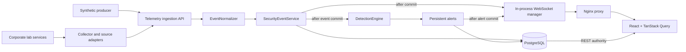

# Live Telemetry

SENTINEL transports normalized security observations from both real corporate-lab services and the optional synthetic producer, displays them live, and evaluates them with deterministic rules. It does not correlate alerts into incidents or take active response actions.

## Pipeline



The canonical `SecurityEvent` remains the only event representation. The telemetry and stored-resource POST routes share `EventIngestionService`; every lab adapter produces the existing `SecurityEventCreate` contract instead of manipulating ORM entities. GETs and WebSocket reconnects never invoke detection.

## Corporate lab telemetry

Real activity is written by the service that observed or performed it, then parsed by a separate collector:

- `WebAccessAdapter`: actual FastAPI request records.
- `WebAuthenticationAdapter`: actual portal login decisions.
- `LinuxAuthAdapter`: OpenSSH authentication output.
- `ProcessAdapter`: results from actually executed controlled commands.
- `SudoAdapter`: an actual allow-listed sudo command result.
- `PostgresAdapter`: native PostgreSQL JSON connection, query-category, and disconnection logs.
- `NetworkConnectionAdapter`: the result of a known real internal client operation; no packet sniffing.
- `DatabaseClientConnectionAdapter`: the actual fixed `psql` connection result, explicitly connection-only evidence used for reliable ScenarioRun attribution.
- `ServiceHealthAdapter`: low-rate service heartbeat telemetry.

Source timestamps are required and normalized to UTC. `raw_event` preserves the relevant source record after secret-field redaction. `normalized_data.origin` is `corporate_lab`; synthetic records use `synthetic`. PostgreSQL connection events explicitly state that connection evidence does not assert collection.

Controlled simulator actions add backend-generated `scenario_run_id` and `scenario_id` correlation. Structured host logs carry them directly. The fixed SSH destination agent assigns prepared IDs to the bounded authentication records it observes. PostgreSQL actions use a validated `application_name` marker that the adapter parses without treating query text as control input. Adapters persist the values in dedicated SecurityEvent columns and normalized metadata. Ordinary background activity has null scenario attribution.

Attribution never changes matching semantics. Run event totals query the persisted correlation column, and observed Alerts are joined through relational AlertEvent evidence. The frontend does not infer attribution from time windows or claim expected rules fired when no attributed alert exists.

The collector maintains a file fingerprint and byte offset per source, retries temporary API failures with backoff capped at 30 seconds, and never advances a failed delivery. This is pragmatic single-node buffering, not a durable queue.

## Normalized input

Send one timezone-aware ISO 8601 event to `POST /api/v1/telemetry/events`. When `COLLECTOR_API_KEY` is configured, include it as `X-Sentinel-Collector-Key`. Categorical text and hostnames are trimmed and normalized, IP addresses and ports are validated, timestamps are converted to UTC, and raw JSON is stored without evaluation. The UI renders evidence through React text/JSON escaping and never injects raw HTML.

Asset resolution uses this order:

1. Valid explicit asset UUID
2. Exact normalized hostname
3. A single inventory match across destination and source IP

Multiple IP matches are ambiguous and leave the event unresolved. Unknown assets are not created. If resolved, `last_seen` moves forward only when the event timestamp is newer, in the same database transaction as the event.

## Persistence and delivery

The transaction commits before serialization and broadcast. The socket therefore carries the persistent UUID and the event is immediately REST-queryable. Zero clients, a disconnected client, or one failed client never prevents storage or affects other clients.

Messages use a version `1` envelope and support `security_event`, `alert_created`, `alert_updated`, `telemetry_status`, and the five `simulation_*` lifecycle types. Simulation progress is not security telemetry and is used only to prompt authoritative ScenarioRun refetches. The manager is in memory and suitable for the single backend process in Compose. Horizontal deployments require shared pub/sub and cross-instance suppression coordination.

## Browser behavior

The application maintains one reusable socket. It uses exponential reconnect delays with jitter and a 30-second maximum. Intentional component shutdown closes without reconnecting. A successful reconnection invalidates event, asset, and dashboard queries because PostgreSQL, not WebSocket delivery, is authoritative.

Safe page-one lists receive compatible events directly, sorted and deduplicated by database ID. Historical pages/time ranges display a count and a **Show newest** action. New rows receive a brief restrained highlight. Dashboard and asset-detail refreshes are debounced to avoid request storms.

## Synthetic producer

With the seeded stack running:

```bash
python tools/telemetry_producer.py --mode single
python tools/telemetry_producer.py --mode stream --count 25 --interval 2
python tools/telemetry_producer.py --mode burst --count 100
```

`make telemetry` runs the bounded stream and `make telemetry-burst` sends 100 events. `SENTINEL_URL` or `--target` selects an explicit SENTINEL base URL. The producer reuses its HTTP connection, supports `Ctrl+C`, and generates coherent but entirely synthetic development observations for the seeded hosts.

`make detection-demo` sends ten synthetic failed-SSH observations to exercise `DET-SSH-001`. It does not open an SSH connection or perform an attack. Repeating the same source inside the suppression window updates the existing alert; `--demo-source-ip` selects another grouping value for a fresh demonstration.

## Production limitations

The shared collector key is development-grade. The platform intentionally has no TLS deployment, per-collector identity, durable message broker, high-volume stream processing, agent management, retention policy, incident correlation, or cross-instance WebSocket distribution. Keep the default services loopback-bound and do not expose the lab or ingestion boundary as a production service.
