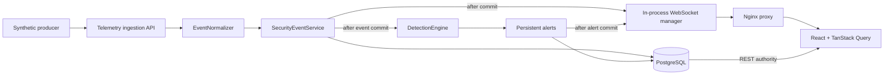

# Live Telemetry

SENTINEL transports normalized security observations, displays them live, and evaluates them with deterministic Milestone 3 rules. It does not correlate alerts into incidents or take active response actions.

## Pipeline



The canonical `SecurityEvent` remains the only event representation. The telemetry and stored-resource POST routes share `EventIngestionService`; future source adapters should produce the existing `SecurityEventCreate` contract instead of manipulating ORM entities. GETs and WebSocket reconnects never invoke detection.

## Normalized input

Send one timezone-aware ISO 8601 event to `POST /api/v1/telemetry/events`. Categorical text and hostnames are trimmed and normalized, IP addresses and ports are validated, timestamps are converted to UTC, and raw JSON is stored without evaluation. The UI renders evidence through React text/JSON escaping and never injects raw HTML.

Asset resolution uses this order:

1. Valid explicit asset UUID
2. Exact normalized hostname
3. A single inventory match across destination and source IP

Multiple IP matches are ambiguous and leave the event unresolved. Unknown assets are not created. If resolved, `last_seen` moves forward only when the event timestamp is newer, in the same database transaction as the event.

## Persistence and delivery

The transaction commits before serialization and broadcast. The socket therefore carries the persistent UUID and the event is immediately REST-queryable. Zero clients, a disconnected client, or one failed client never prevents storage or affects other clients.

Messages use a version `1` envelope and support `security_event`, `alert_created`, `alert_updated`, and `telemetry_status`. The manager is in memory and suitable for the single backend process in Compose. Horizontal deployments require shared pub/sub and cross-instance suppression coordination.

## Browser behavior

The application maintains one reusable socket. It uses exponential reconnect delays with jitter and a 30-second maximum. Intentional component shutdown closes without reconnecting. A successful reconnection invalidates event, asset, and dashboard queries because PostgreSQL, not WebSocket delivery, is authoritative.

Safe page-one lists receive compatible events directly, sorted and deduplicated by database ID. Historical pages/time ranges display a count and a **Show newest** action. New rows receive a brief restrained highlight. Dashboard and asset-detail refreshes are debounced to avoid request storms.

## Synthetic producer

With the seeded stack running:

```bash
python tools/telemetry_producer.py --mode single
python tools/telemetry_producer.py --mode stream --count 25 --interval 2
python tools/telemetry_producer.py --mode burst --count 100
```

`make telemetry` runs the bounded stream and `make telemetry-burst` sends 100 events. `SENTINEL_URL` or `--target` selects an explicit SENTINEL base URL. The producer reuses its HTTP connection, supports `Ctrl+C`, and generates coherent but entirely synthetic development observations for the seeded hosts.

`make detection-demo` sends ten synthetic failed-SSH observations to exercise `DET-SSH-001`. It does not open an SSH connection or perform an attack. Repeating the same source inside the suppression window updates the existing alert; `--demo-source-ip` selects another grouping value for a fresh demonstration.

## Production limitations

The platform intentionally has no collector authentication, TLS deployment, durable event queue, high-volume stream processing, agent management, retention policy, incident correlation, or cross-instance WebSocket distribution. Keep the default services loopback-bound and do not publish telemetry ingestion as an unauthenticated production API.
